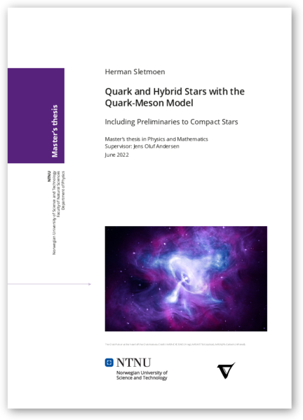

### Quark and Hybrid Stars with the Quark-Meson Model – Including Preliminaries to Compact Stars 

**Astract:** According to quantum chromodynamics, hadron-confined quarks break free into a state of deconfined quark matter at high density.
Recent observations of the massive *2 M_⊙*-pulsars PSR J1614−2230, PSR J0348+0432 and PSR J0740+6620 suggest that the density in neutron stars could reach sufficiently high levels for formation of small cores of deconfined quark matter in what is then referred to as hybrid stars.
If the strange matter hypothesis is true and strange quark matter is stable, even pure strange quark stars consisting only of deconfined strange quark matter could exist.
After reviewing the MIT bag model, we model quark stars with the effective quark-meson model of quantum chromodynamics, calculating its grand potential to one fermion loop in the mean-field approximation for bosons, which is consistent in the large-*N_c* limit.
We find maximum masses *M ≤ 2.0 M_⊙* and *M ≤ 1.8 M_⊙* with two and three flavors, respectively, but fail to model strange quark stars consistently.
In particular, we struggle to fit measured masses of the *σ* meson to the grand potential at tree-level, but resolve this using recent work of Adhikari and others who consistently fit parameters in the one-loop large-*N_c* limit.
Finally, we assemble hybrid stars by joining the quark-meson model with the hadronic Akmal-Pandharipande-Ravenhall equation of state.
This generates short branches of stable hybrid stars with plausible maximum masses *1.9 M_⊙ ≤ M ≤ 2.1 M_⊙* and small two-flavor and three-flavor quark cores up to *0.12 M_⊙* and *0.02 M_⊙*, respectively.
A discontinuous phase transition destabilizes stars with heavier quark cores.
The results agree with other work that uses variations of the quark-meson model and the Nambu-Jona-Lasinio model.
